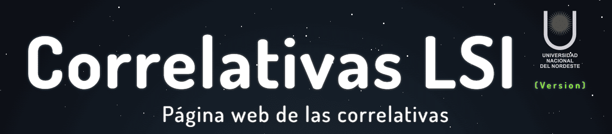

# 📘 Correlativas LSI



<p align="center">
  <a href="https://1hagi.github.io/correlativas_lsi/" target="_blank">
    
  </a>
  &nbsp;&nbsp;
  <a href="https://github.com/1Hagi/correlativas_lsi" target="_blank">
    
  </a>
</p>

La aplicación web para ver tus materias correlativas.

<br>

## 🎯 Objetivo

La web está destinada a que los alumnos de la carrera **Lic. en Sistemas de Info.** de la UNNE puedan ver sus materias correlativas de forma **rápida**, **sencilla** e **intuitiva**.

<br>

## 🚀 Características

La web consta de tablas y columnas que separan años y cuatrimestres de la carrera.

Cada materia es un cuadro que puede actualizar su estado.

Estados:
- ⚪ Sin Cursar.
- 🟠 Regular.
- 🟢 Aprobado.

Ver Requisitos:
- ⚫ Una materia que no puede ser cursada se muestra en gris, puedes hacer click en ella ver cuales son sus correlativas faltantes.

Cada vez que actualices el estado de una materia se podrán ver como se van "desbloqueando" las demás materias.

<br>

## 📚 Detalles

Carrera: 
- Licenciatura en Sistemas de Información (UNNE)

Plan de Estudio:
- Plan Nuevo : Para alumnos ingresados de años recientes.
- Plan Anterior : Para alumnos avanzados (El cambio al nuevo es obligatorio a partir del 2026).

<br>

## 💻 Tecnologías, Diseño y Desarrollo

Tecnologias utilizadas:
- HTML5, CSS3, JavaScript

Responsive Web Design:
- Diseño adaptado para dispositivos Móbiles, Tablet, Laptop, PC.

Estructura del proyecto:

```txt
correlativas_lsi/
├── css/                       # Estilos
├── img/                       # Imágenes
├── js/                        # Scripts JavaScript
├── index.html                 # Página inicial
├── plan_estudio_anterior.html # Vista correlativas plan 2009
├── plan_estudio_nuevo.html    # Vista correlativas plan 2023
└── README.md                  # Documentación del proyecto
```

<br>

 ## 🧑‍💻 Contribuciones

Si quieres expendir tu portafolio como desarrollador web y contribuir a éste proyecto de manera oficial, puedes contactarme a travéz de cualquiera de mis redes sociales (links en la web).
